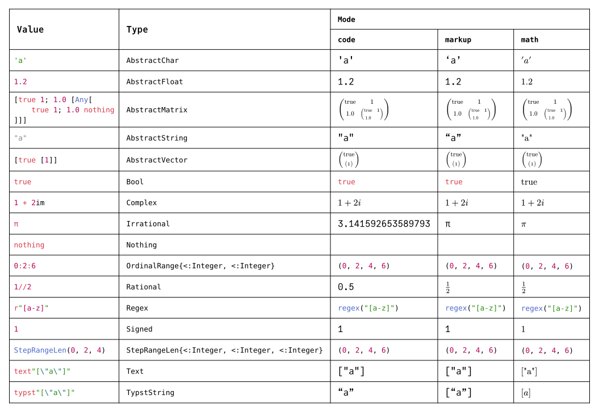

# Getting Started

## Examples

This Typst source file and corresponding document were generated from Julia using \
[`show(::IO, ::MIME"text/typst", ::Union{Typst, TypstString})`](@ref) to print Julia values
to Typst format and a [`TypstCommand`](@ref) to render it.

A [`Mode`](@ref) specifies the current Typst context.
The formatting of each type corresponds to the most useful Typst value for a given mode.
If no such value exists, it is formatted to render in a canonical representation.

!!! note
    Although many of the values are rendered similarly across modes,
    the underlying Typst source code differs between them.

```@eval
using Markdown: parse
parse("```typst\n" * read("assets/strings.typ", String) * "\n```")
```


